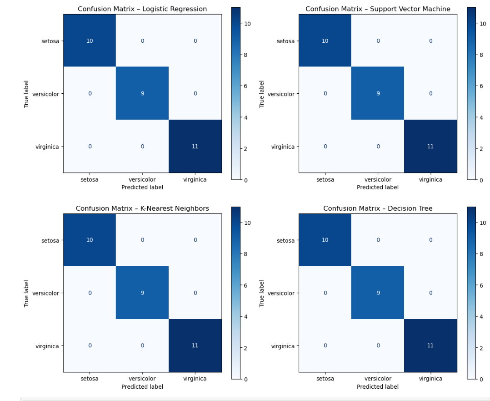
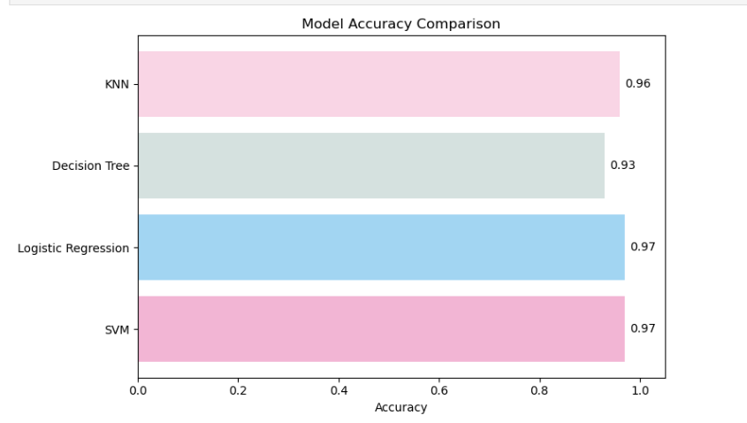

#  Iris Flower Classification
This project is a machine learning model to classify **Iris flower species** (Setosa, Versicolor, Virginica) based on their features: sepal length, sepal width, petal length, and petal width.

##  Problem Statement

The goal is to build a classification model that can predict the species of an Iris flower using the famous **Iris dataset**. It's a beginner-friendly project used to understand supervised learning and classification algorithms.

---

##  Algorithms Used

- Logistic Regression
- K-Nearest Neighbors (KNN)
- Decision Tree
- Support Vector Machine (SVM)

---

##  Dataset Info

- **Source:** UCI Machine Learning Repository
- **Features:**
  - Sepal Length
  - Sepal Width
  - Petal Length
  - Petal Width
- **Target:** Species (`Setosa`, `Versicolor`, `Virginica`)

---

##  Results

- Achieved **high accuracy**  (95%) using SVM and Logistic Regression.
- Plotted confusion matrices and accuracy comparisons for multiple algorithms.

---

## Technologies Used

- Python
- NumPy, Pandas
- Scikit-learn
- Matplotlib, Seaborn
- Jupyter Notebook

---

##  Sample Visualizations

---

---

